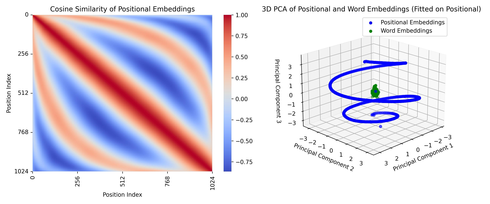
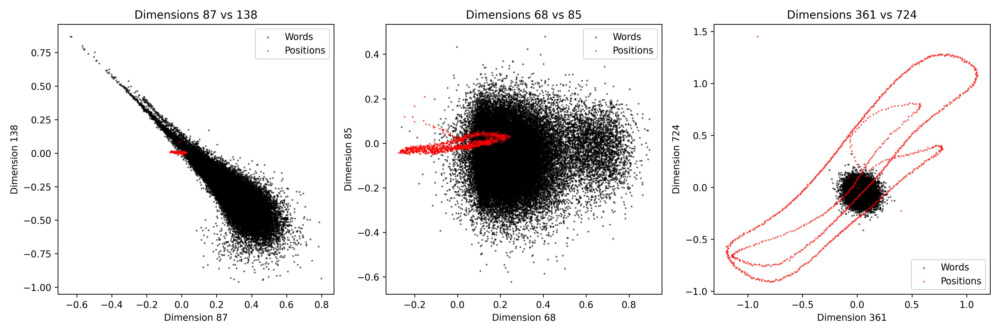
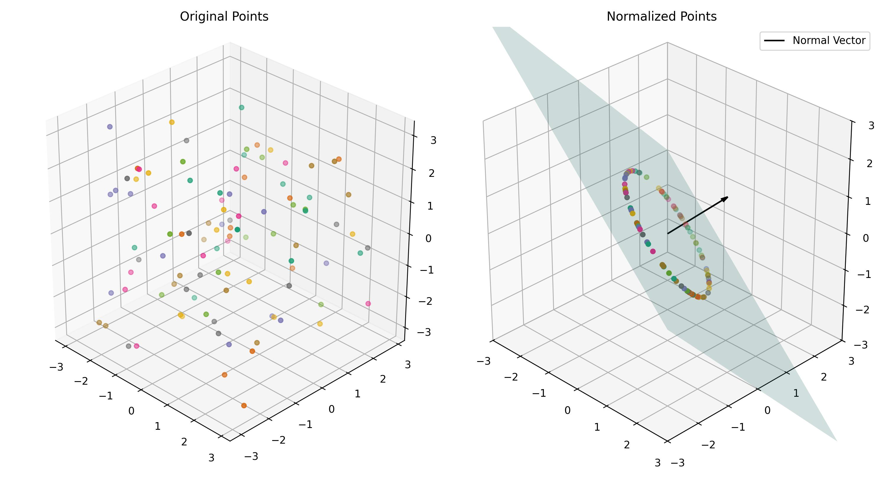

# GPT-2 Unraveled 🤖✨

This project focuses on understanding the internal workings of GPT-2, providing a detailed exploration of its embedding space, layers, and processing mechanisms. The repository includes comprehensive code for dissecting these components, along with an analysis report summarizing insights into the geometric and functional behavior of GPT-2.



## 🔍 Introduction

GPT-2, developed by OpenAI (https://github.com/openai/gpt-2), marked a significant advancement in natural language processing at the time of its release. This project dives deep into its inner workings, particularly focusing on:
- The embedding space of the model
- The structure and function of attention heads
- The role of multi-layer perceptrons (MLPs) in storing knowledge
- The effects of layer normalization and its geometric interpretation

For a detailed explanation of the research and methods used, check out the accompanying report for this project: [GPT-2 Analysis Report](./gpt2_analysis.pdf).

## ⚙️ Installation

To set up the environment, it is recommended to use a virtual environment with `Miniconda` or `virtualenv`. Follow these steps to install the necessary dependencies:

1. Create and activate a virtual environment:
    ```bash
    conda create -n gpt2 python=3.12 -y
    conda activate gpt2
    ```

2. Install the required dependencies:
    ```bash
    pip install -r requirements.txt
    ```

## 🚀 Usage

The repository contains three scripts for analyzing different aspects of GPT-2. To run the analysis:

1. **Explore GPT-2 Embeddings**:
    ```bash
    python 1_explore_embeddings.py
    ```

2. **Understanding the Model Layers**:
    ```bash
    python 2_layers_understanding.py
    ```

3. **Tracking Token Transformations**:
    ```bash
    python 3_tokens_journey.py
    ```

Each script will output plots and analyses to help you better understand how GPT-2 processes input data.

## 🔬 Exploration

### Embedding Analysis
In the first script, the analysis focuses on understanding how GPT-2's token embeddings and positional embeddings are structured in high-dimensional space. Key findings include:
- Systematic offsets in certain dimensions of the embedding space
- The discovery of dimensions where position embeddings are active
- The dimensionality reduction of token and position embeddings using PCA



### Layers and Attention
The second script dives into how the residual stream and attention heads operate within the model. Visualizations are generated for:
- Self-attention matrices
- Multi-layer perceptron (MLP) behavior
- Layer normalization's effect on the high-dimensional space




### Token Journey
The third script tracks the evolution of tokens as they pass through the model layers, showing how token representations change layer by layer until they predict the next token.

## 📄 License

This project is licensed under the MIT License and is free to reuse - see the [LICENSE](LICENSE) file for details.
